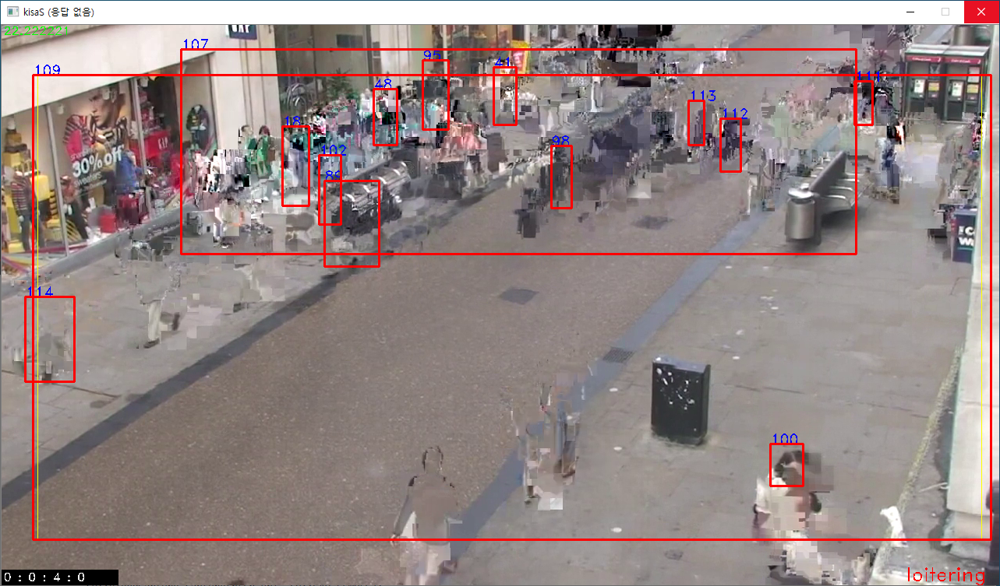

# Recieve VLC Streaming(RTSP) with OpenCV 3.4

### installation

1. OpenCV 3.4

    : [reference](https://github.com/SangA-Lee/INSTALLATION/blob/main/Opencv%203.4.md)

2. VLC 

    : [download VLC](https://www.videolan.org/vlc/download-windows.ko.html)
    
### 1st try - fail

        cv::VideoCapture capture(rtsp_url, cv::CAP_FFMPEG);
        
> [rtsp @ 0000018067cc24a0] method SETUP failed: 461 Client error

* *rtsp is taken default tcp on ffmpeg of opencv*

### 2nd try - fail

set Environment Variable 

                  [variable]          |       [value]
        OPENCV_FFMPEG_CAPTURE_OPTIONS | rtsp_transport;udp

and then

        cv::VideoCapture capture(rtsp_url, cv::CAP_FFMPEG);

> [h264 @ 0000019c8126ada0] Missing reference picture, default is 0  
> [h264 @ 0000025d8fcea860] co located POCs unavailable  
> [h264 @ 0000025d8fcfd140] mmco: unref short failure  
> [h264 @ 0000025d8f8e0a20] error while decoding MB 43 11, bytestream -5  
> [h264 @ 0000019d8f2742a0] reference picture missing during reorder

</img>

* *forcly set the rtsp is taken udp and then success that show video but missed the data*

### 3rd try - fail

GStreamer download MSVC 64-bit [Run-time](https://gstreamer.freedesktop.org/data/pkg/windows/1.18.1/msvc/gstreamer-1.0-msvc-x86_64-1.18.1.msi) and [Development](https://gstreamer.freedesktop.org/data/pkg/windows/1.18.1/msvc/gstreamer-1.0-devel-msvc-x86_64-1.18.1.msi)

and then, set environment variable

          [variable]    |                      [value]
         GSTREAMER_DIR  | /path/to/gstreamer/1.0/msvc_x86_64
        GST_PLUGIN_PATH | /path/to/gstreamer/1.0/msvc_x86_64/lib/gstreamer-1.0

OpenCV build with GStreamer

link with my project

        cv::VideoCapture capture(rtsp_url, cv::CAP_GSTREAMER);
        
> (test.exe:31608): GStreamer-WARNING **: 14:43:39.298: Failed to load plugin 'D:\gstreamer\1.0\msvc_x86_64\lib\gstreamer-1.0\libgstaccurip.dll': 'D:\gstreamer\1.0\msvc_x86_64\lib\gstreamer-1.0\libgstaccurip.dll': 지정된 모듈을 찾 을 수 없습니다.  
> (test.exe:31608): GStreamer-WARNING **: 14:43:39.357: Failed to load plugin 'D:\gstreamer\1.0\msvc_x86_64\lib\gstreamer-1.0\libgstadder.dll': 'D:\gstreamer\1.0\msvc_x86_64\lib\gstreamer-1.0\libgstadder.dll': 지정된 모듈을 찾을 수 없습니다.  
> (test.exe:31608): GStreamer-WARNING **: 14:43:39.408: Failed to load plugin 'D:\gstreamer\1.0\msvc_x86_64\lib\gstreamer-1.0\libgstadpcmdec.dll': 'D:\gstreamer\1.0\msvc_x86_64\lib\gstreamer-1.0\libgstadpcmdec.dll': 지정된 모듈을  찾을 수 없습니다.  
> (test.exe:31608): GStreamer-WARNING **: 14:43:39.467: Failed to load plugin 'D:\gstreamer\1.0\msvc_x86_64\lib\gstreamer-1.0\libgstadpcmenc.dll': 'D:\gstreamer\1.0\msvc_x86_64\lib\gstreamer-1.0\libgstadpcmenc.dll': 지정된 모듈을  찾을 수 없습니다.  
> (test.exe:31608): GStreamer-WARNING **: 14:43:39.519: Failed to load plugin 'D:\gstreamer\1.0\msvc_x86_64\lib\gstreamer-1.0\libgstaiff.dll': 'D:\gstreamer\1.0\msvc_x86_64\lib\gstreamer-1.0\libgstaiff.dll': 지정된 모듈을 찾을 수  없습니다.  
> (test.exe:31608): GStreamer-WARNING **: 14:43:39.586: Failed to load plugin 'D:\gstreamer\1.0\msvc_x86_64\lib\gstreamer-1.0\libgstalaw.dll': 'D:\gstreamer\1.0\msvc_x86_64\lib\gstreamer-1.0\libgstalaw.dll': 지정된 모듈을 찾을 수  없습니다.  
> (test.exe:31608): GStreamer-WARNING **: 14:43:39.642: Failed to load plugin 'D:\gstreamer\1.0\msvc_x86_64\lib\gstreamer-1.0\libgstalpha.dll': 'D:\gstreamer\1.0\msvc_x86_64\lib\gstreamer-1.0\libgstalpha.dll': 지정된 모듈을 찾을 수 없습니다.  
> (test.exe:31608): GStreamer-WARNING **: 14:43:39.708: Failed to load plugin 'D:\gstreamer\1.0\msvc_x86_64\lib\gstreamer-1.0\libgstalphacolor.dll': 'D:\gstreamer\1.0\msvc_x86_64\lib\gstreamer-1.0\libgstalphacolor.dll': 지정된 모듈을 찾을 수 없습니다.  
> (test.exe:31608): GStreamer-WARNING **: 14:43:39.776: Failed to load plugin 'D:\gstreamer\1.0\msvc_x86_64\lib\gstreamer-1.0\libgstapetag.dll': 'D:\gstreamer\1.0\msvc_x86_64\lib\gstreamer-1.0\libgstapetag.dll': 지정된 모듈을 찾을 수 없습니다.  
> (test.exe:31608): GStreamer-WARNING **: 14:43:39.812: Failed to load plugin 'D:\gstreamer\1.0\msvc_x86_64\lib\gstreamer-1.0\libgstapp.dll': 'D:\gstreamer\1.0\msvc_x86_64\lib\gstreamer-1.0\libgstapp.dll': 지정된 모듈을 찾을 수 없 습니다.  
> (test.exe:31608): GStreamer-WARNING **: 14:43:39.894: Failed to load plugin 'D:\gstreamer\1.0\msvc_x86_64\lib\gstreamer-1.0\libgstaudiobuffersplit.dll': 'D:\gstreamer\1.0\msvc_x86_64\lib\gstreamer-1.0\libgstaudiobuffersplit.dll': 지정된 모듈을 찾을 수 없습니다.  
> (test.exe:31608): GStreamer-WARNING **: 14:43:39.949: Failed to load plugin 'D:\gstreamer\1.0\msvc_x86_64\lib\gstreamer-1.0\libgstaudioconvert.dll': 'D:\gstreamer\1.0\msvc_x86_64\lib\gstreamer-1.0\libgstaudioconvert.dll': 지정된 모듈을 찾을 수 없습니다.  
> (test.exe:31608): GStreamer-WARNING **: 14:43:40.013: Failed to load plugin 'D:\gstreamer\1.0\msvc_x86_64\lib\gstreamer-1.0\libgstaudiofx.dll': 'D:\gstreamer\1.0\msvc_x86_64\lib\gstreamer-1.0\libgstaudiofx.dll': 지정된 모듈을 찾 을 수 없습니다.  
> (test.exe:31608): GStreamer-WARNING **: 14:43:40.058: Failed to load plugin 'D:\gstreamer\1.0\msvc_x86_64\lib\gstreamer-1.0\libgstaudiofxbad.dll': 'D:\gstreamer\1.0\msvc_x86_64\lib\gstreamer-1.0\libgstaudiofxbad.dll': 지정된 모듈을 찾을 수 없습니다.  
> (test.exe:31608): GStreamer-WARNING **: 14:43:40.088: Failed to load plugin 'D:\gstreamer\1.0\msvc_x86_64\lib\gstreamer-1.0\libgstaudiolatency.dll': 'D:\gstreamer\1.0\msvc_x86_64\lib\gstreamer-1.0\libgstaudiolatency.dll': 지정된 모듈을 찾을 수 없습니다.  
> (test.exe:31608): GStreamer-WARNING **: 14:43:40.150: Failed to load plugin 'D:\gstreamer\1.0\msvc_x86_64\lib\gstreamer-1.0\libgstaudiomixer.dll': 'D:\gstreamer\1.0\msvc_x86_64\lib\gstreamer-1.0\libgstaudiomixer.dll': 지정된 모듈을 찾을 수 없습니다.  
> (test.exe:31608): GStreamer-WARNING **: 14:43:40.195: Failed to load plugin 'D:\gstreamer\1.0\msvc_x86_64\lib\gstreamer-1.0\libgstaudiomixmatrix.dll': 'D:\gstreamer\1.0\msvc_x86_64\lib\gstreamer-1.0\libgstaudiomixmatrix.dll': 지 정된 모듈을 찾을 수 없습니다.  
> (test.exe:31608): GStreamer-WARNING **: 14:43:40.257: Failed to load plugin 'D:\gstreamer\1.0\msvc_x86_64\lib\gstreamer-1.0\libgstaudioparsers.dll': 'D:\gstreamer\1.0\msvc_x86_64\lib\gstreamer-1.0\libgstaudioparsers.dll': 지정된 모듈을 찾을 수 없습니다.  
> (test.exe:31608): GStreamer-WARNING **: 14:43:40.292: Failed to load plugin 'D:\gstreamer\1.0\msvc_x86_64\lib\gstreamer-1.0\libgstaudiorate.dll': 'D:\gstreamer\1.0\msvc_x86_64\lib\gstreamer-1.0\libgstaudiorate.dll': 지정된 모듈을 찾을 수 없습니다.  
> (test.exe:31608): GStreamer-WARNING **: 14:43:40.343: Failed to load plugin 'D:\gstreamer\1.0\msvc_x86_64\lib\gstreamer-1.0\libgstaudioresample.dll': 'D:\gstreamer\1.0\msvc_x86_64\lib\gstreamer-1.0\libgstaudioresample.dll': 지정 된 모듈을 찾을 수 없습니다.  
> (test.exe:31608): GStreamer-WARNING **: 14:43:40.401: Failed to load plugin 'D:\gstreamer\1.0\msvc_x86_64\lib\gstreamer-1.0\libgstaudiotestsrc.dll': 'D:\gstreamer\1.0\msvc_x86_64\lib\gstreamer-1.0\libgstaudiotestsrc.dll': 지정된 모듈을 찾을 수 없습니다.  
> (test.exe:31608): GStreamer-WARNING **: 14:43:40.474: Failed to load plugin 'D:\gstreamer\1.0\msvc_x86_64\lib\gstreamer-1.0\libgstaudiovisualizers.dll': 'D:\gstreamer\1.0\msvc_x86_64\lib\gstreamer-1.0\libgstaudiovisualizers.dll': 지정된 모듈을 찾을 수 없습니다.  
> (test.exe:31608): GStreamer-WARNING **: 14:43:40.524: Failed to load plugin 'D:\gstreamer\1.0\msvc_x86_64\lib\gstreamer-1.0\libgstauparse.dll': 'D:\gstreamer\1.0\msvc_x86_64\lib\gstreamer-1.0\libgstauparse.dll': 지정된 모듈을 찾 을 수 없습니다.  
> (test.exe:31608): GStreamer-WARNING **: 14:43:40.553: Failed to load plugin 'D:\gstreamer\1.0\msvc_x86_64\lib\gstreamer-1.0\libgstautoconvert.dll': 'D:\gstreamer\1.0\msvc_x86_64\lib\gstreamer-1.0\libgstautoconvert.dll': 지정된 모듈을 찾을 수 없습니다.  
. (test.exe:31608): GStreamer-WARNING **: 14:43:40.583: Failed to load plugin 'D:\gstreamer\1.0\msvc_x86_64\lib\gstreamer-1.0\libgstautodetect.dll': 'D:\gstreamer\1.0\msvc_x86_64\lib\gstreamer-1.0\libgstautodetect.dll': 지정된 모듈을 찾을 수 없습니다.  
> (test.exe:31608): GStreamer-WARNING **: 14:43:40.635: Failed to load plugin 'D:\gstreamer\1.0\msvc_x86_64\lib\gstreamer-1.0\libgstavi.dll': 'D:\gstreamer\1.0\msvc_x86_64\lib\gstreamer-1.0\libgstavi.dll': 지정된 모듈을 찾을 수 없 습니다.  
> (test.exe:31608): GStreamer-WARNING **: 14:43:40.699: Failed to load plugin 'D:\gstreamer\1.0\msvc_x86_64\lib\gstreamer-1.0\libgstbayer.dll': 'D:\gstreamer\1.0\msvc_x86_64\lib\gstreamer-1.0\libgstbayer.dll': 지정된 모듈을 찾을 수 없습니다.  
> (test.exe:31608): GStreamer-WARNING **: 14:43:40.791: Failed to load plugin 'D:\gstreamer\1.0\msvc_x86_64\lib\gstreamer-1.0\libgstbz2.dll': 'D:\gstreamer\1.0\msvc_x86_64\lib\gstreamer-1.0\libgstbz2.dll': 지정된 모듈을 찾을 수 없 습니다.  
> (test.exe:31608): GStreamer-WARNING **: 14:43:40.822: Failed to load plugin 'D:\gstreamer\1.0\msvc_x86_64\lib\gstreamer-1.0\libgstcairo.dll': 'D:\gstreamer\1.0\msvc_x86_64\lib\gstreamer-1.0\libgstcairo.dll': 지정된 모듈을 찾을 수 없습니다.  
> (test.exe:31608): GStreamer-WARNING **: 14:43:40.896: Failed to load plugin 'D:\gstreamer\1.0\msvc_x86_64\lib\gstreamer-1.0\libgstclosedcaption.dll': 'D:\gstreamer\1.0\msvc_x86_64\lib\gstreamer-1.0\libgstclosedcaption.dll': 지정 된 모듈을 찾을 수 없습니다.  
> (test.exe:31608): GStreamer-WARNING **: 14:43:40.969: Failed to load plugin 'D:\gstreamer\1.0\msvc_x86_64\lib\gstreamer-1.0\libgstcoloreffects.dll': 'D:\gstreamer\1.0\msvc_x86_64\lib\gstreamer-1.0\libgstcoloreffects.dll': 지정된 모듈을 찾을 수 없습니다.  
> (test.exe:31608): GStreamer-WARNING **: 14:43:41.063: Failed to load plugin 'D:\gstreamer\1.0\msvc_x86_64\lib\gstreamer-1.0\libgstcompositor.dll': 'D:\gstreamer\1.0\msvc_x86_64\lib\gstreamer-1.0\libgstcompositor.dll': 지정된 모듈을 찾을 수 없습니다.  
> (test.exe:31608): GStreamer-WARNING **: 14:43:41.170: Failed to load plugin 'D:\gstreamer\1.0\msvc_x86_64\lib\gstreamer-1.0\libgstcoreelements.dll': 'D:\gstreamer\1.0\msvc_x86_64\lib\gstreamer-1.0\libgstcoreelements.dll': 지정된 모듈을 찾을 수 없습니다.  
> (test.exe:31608): GStreamer-WARNING **: 14:43:41.250: Failed to load plugin 'D:\gstreamer\1.0\msvc_x86_64\lib\gstreamer-1.0\libgstcoretracers.dll': 'D:\gstreamer\1.0\msvc_x86_64\lib\gstreamer-1.0\libgstcoretracers.dll': 지정된 모듈을 찾을 수 없습니다.  
> (test.exe:31608): GStreamer-WARNING **: 14:43:41.300: Failed to load plugin 'D:\gstreamer\1.0\msvc_x86_64\lib\gstreamer-1.0\libgstcutter.dll': 'D:\gstreamer\1.0\msvc_x86_64\lib\gstreamer-1.0\libgstcutter.dll': 지정된 모듈을 찾을 수 없습니다.  
> (test.exe:31608): GStreamer-WARNING **: 14:43:41.387: Failed to load plugin 'D:\gstreamer\1.0\msvc_x86_64\lib\gstreamer-1.0\libgstd3d.dll': 'D:\gstreamer\1.0\msvc_x86_64\lib\gstreamer-1.0\libgstd3d.dll': 지정된 모듈을 찾을 수 없 습니다.  
> (test.exe:31608): GStreamer-WARNING **: 14:43:41.461: Failed to load plugin 'D:\gstreamer\1.0\msvc_x86_64\lib\gstreamer-1.0\libgstd3d11.dll': 'D:\gstreamer\1.0\msvc_x86_64\lib\gstreamer-1.0\libgstd3d11.dll': 지정된 모듈을 찾을 수 없습니다.  
> (test.exe:31608): GStreamer-WARNING **: 14:43:41.543: Failed to load plugin 'D:\gstreamer\1.0\msvc_x86_64\lib\gstreamer-1.0\libgstdash.dll': 'D:\gstreamer\1.0\msvc_x86_64\lib\gstreamer-1.0\libgstdash.dll': 지정된 모듈을 찾을 수  없습니다.  
> (test.exe:31608): GStreamer-WARNING **: 14:43:41.604: Failed to load plugin 'D:\gstreamer\1.0\msvc_x86_64\lib\gstreamer-1.0\libgstdebug.dll': 'D:\gstreamer\1.0\msvc_x86_64\lib\gstreamer-1.0\libgstdebug.dll': 지정된 모듈을 찾을 수 없습니다.  
> (test.exe:31608): GStreamer-WARNING **: 14:43:41.644: Failed to load plugin 'D:\gstreamer\1.0\msvc_x86_64\lib\gstreamer-1.0\libgstdebugutilsbad.dll': 'D:\gstreamer\1.0\msvc_x86_64\lib\gstreamer-1.0\libgstdebugutilsbad.dll': 지정 된 모듈을 찾을 수 없습니다.  
> (test.exe:31608): GStreamer-WARNING **: 14:43:41.709: Failed to load plugin 'D:\gstreamer\1.0\msvc_x86_64\lib\gstreamer-1.0\libgstdecklink.dll': 'D:\gstreamer\1.0\msvc_x86_64\lib\gstreamer-1.0\libgstdecklink.dll': 지정된 모듈을  찾을 수 없습니다.  
> (test.exe:31608): GStreamer-WARNING **: 14:43:41.768: Failed to load plugin 'D:\gstreamer\1.0\msvc_x86_64\lib\gstreamer-1.0\libgstdeinterlace.dll': 'D:\gstreamer\1.0\msvc_x86_64\lib\gstreamer-1.0\libgstdeinterlace.dll': 지정된 모듈을 찾을 수 없습니다.  
> (test.exe:31608): GStreamer-WARNING **: 14:43:41.829: Failed to load plugin 'D:\gstreamer\1.0\msvc_x86_64\lib\gstreamer-1.0\libgstdirectsound.dll': 'D:\gstreamer\1.0\msvc_x86_64\lib\gstreamer-1.0\libgstdirectsound.dll': 지정된 모듈을 찾을 수 없습니다.  
> (test.exe:31608): GStreamer-WARNING **: 14:43:41.880: Failed to load plugin 'D:\gstreamer\1.0\msvc_x86_64\lib\gstreamer-1.0\libgstdtls.dll': 'D:\gstreamer\1.0\msvc_x86_64\lib\gstreamer-1.0\libgstdtls.dll': 지정된 모듈을 찾을 수  없습니다.  
> (test.exe:31608): GStreamer-WARNING **: 14:43:41.921: Failed to load plugin 'D:\gstreamer\1.0\msvc_x86_64\lib\gstreamer-1.0\libgstdtmf.dll': 'D:\gstreamer\1.0\msvc_x86_64\lib\gstreamer-1.0\libgstdtmf.dll': 지정된 모듈을 찾을 수  없습니다.  
> (test.exe:31608): GStreamer-WARNING **: 14:43:41.962: Failed to load plugin 'D:\gstreamer\1.0\msvc_x86_64\lib\gstreamer-1.0\libgstdv.dll': 'D:\gstreamer\1.0\msvc_x86_64\lib\gstreamer-1.0\libgstdv.dll': 지정된 모듈을 찾을 수 없습 니다.  
> (test.exe:31608): GStreamer-WARNING **: 14:43:42.028: Failed to load plugin 'D:\gstreamer\1.0\msvc_x86_64\lib\gstreamer-1.0\libgstdvbsuboverlay.dll': 'D:\gstreamer\1.0\msvc_x86_64\lib\gstreamer-1.0\libgstdvbsuboverlay.dll': 지정 된 모듈을 찾을 수 없습니다.  
> (test.exe:31608): GStreamer-WARNING **: 14:43:42.069: Failed to load plugin 'D:\gstreamer\1.0\msvc_x86_64\lib\gstreamer-1.0\libgstdvdspu.dll': 'D:\gstreamer\1.0\msvc_x86_64\lib\gstreamer-1.0\libgstdvdspu.dll': 지정된 모듈을 찾을 수 없습니다.  
> (test.exe:31608): GStreamer-WARNING **: 14:43:42.134: Failed to load plugin 'D:\gstreamer\1.0\msvc_x86_64\lib\gstreamer-1.0\libgsteffectv.dll': 'D:\gstreamer\1.0\msvc_x86_64\lib\gstreamer-1.0\libgsteffectv.dll': 지정된 모듈을 찾 을 수 없습니다.  
> (test.exe:31608): GStreamer-WARNING **: 14:43:42.188: Failed to load plugin 'D:\gstreamer\1.0\msvc_x86_64\lib\gstreamer-1.0\libgstequalizer.dll': 'D:\gstreamer\1.0\msvc_x86_64\lib\gstreamer-1.0\libgstequalizer.dll': 지정된 모듈을 찾을 수 없습니다.  
> (test.exe:31608): GStreamer-WARNING **: 14:43:42.274: Failed to load plugin 'D:\gstreamer\1.0\msvc_x86_64\lib\gstreamer-1.0\libgstfieldanalysis.dll': 'D:\gstreamer\1.0\msvc_x86_64\lib\gstreamer-1.0\libgstfieldanalysis.dll': 지정 된 모듈을 찾을 수 없습니다.  
> (test.exe:31608): GStreamer-WARNING **: 14:43:42.318: Failed to load plugin 'D:\gstreamer\1.0\msvc_x86_64\lib\gstreamer-1.0\libgstflac.dll': 'D:\gstreamer\1.0\msvc_x86_64\lib\gstreamer-1.0\libgstflac.dll': 지정된 모듈을 찾을 수  없습니다.  
> (test.exe:31608): GStreamer-WARNING **: 14:43:42.385: Failed to load plugin 'D:\gstreamer\1.0\msvc_x86_64\lib\gstreamer-1.0\libgstflv.dll': 'D:\gstreamer\1.0\msvc_x86_64\lib\gstreamer-1.0\libgstflv.dll': 지정된 모듈을 찾을 수 없 습니다.  
> (test.exe:31608): GStreamer-WARNING **: 14:43:42.437: Failed to load plugin 'D:\gstreamer\1.0\msvc_x86_64\lib\gstreamer-1.0\libgstflxdec.dll': 'D:\gstreamer\1.0\msvc_x86_64\lib\gstreamer-1.0\libgstflxdec.dll': 지정된 모듈을 찾을 수 없습니다.  
> (test.exe:31608): GStreamer-WARNING **: 14:43:42.466: Failed to load plugin 'D:\gstreamer\1.0\msvc_x86_64\lib\gstreamer-1.0\libgstfreeverb.dll': 'D:\gstreamer\1.0\msvc_x86_64\lib\gstreamer-1.0\libgstfreeverb.dll': 지정된 모듈을  찾을 수 없습니다.  
> (test.exe:31608): GStreamer-WARNING **: 14:43:42.504: Failed to load plugin 'D:\gstreamer\1.0\msvc_x86_64\lib\gstreamer-1.0\libgstfrei0r.dll': 'D:\gstreamer\1.0\msvc_x86_64\lib\gstreamer-1.0\libgstfrei0r.dll': 지정된 모듈을 찾을 수 없습니다.  
> (test.exe:31608): GStreamer-WARNING **: 14:43:42.557: Failed to load plugin 'D:\gstreamer\1.0\msvc_x86_64\lib\gstreamer-1.0\libgstgaudieffects.dll': 'D:\gstreamer\1.0\msvc_x86_64\lib\gstreamer-1.0\libgstgaudieffects.dll': 지정된 모듈을 찾을 수 없습니다.  
> (test.exe:31608): GStreamer-WARNING **: 14:43:42.615: Failed to load plugin 'D:\gstreamer\1.0\msvc_x86_64\lib\gstreamer-1.0\libgstgdkpixbuf.dll': 'D:\gstreamer\1.0\msvc_x86_64\lib\gstreamer-1.0\libgstgdkpixbuf.dll': 지정된 모듈을 찾을 수 없습니다.  
> (test.exe:31608): GStreamer-WARNING **: 14:43:42.657: Failed to load plugin 'D:\gstreamer\1.0\msvc_x86_64\lib\gstreamer-1.0\libgstgdp.dll': 'D:\gstreamer\1.0\msvc_x86_64\lib\gstreamer-1.0\libgstgdp.dll': 지정된 모듈을 찾을 수 없 습니다.  
> (test.exe:31608): GStreamer-WARNING **: 14:43:42.702: Failed to load plugin 'D:\gstreamer\1.0\msvc_x86_64\lib\gstreamer-1.0\libgstgeometrictransform.dll': 'D:\gstreamer\1.0\msvc_x86_64\lib\gstreamer-1.0\libgstgeometrictransform.dll': 지정된 모듈을 찾을 수 없습니다.  
> (test.exe:31608): GStreamer-WARNING **: 14:43:42.753: Failed to load plugin 'D:\gstreamer\1.0\msvc_x86_64\lib\gstreamer-1.0\libgstgio.dll': 'D:\gstreamer\1.0\msvc_x86_64\lib\gstreamer-1.0\libgstgio.dll': 지정된 모듈을 찾을 수 없 습니다.  
> (test.exe:31608): GStreamer-WARNING **: 14:43:42.814: Failed to load plugin 'D:\gstreamer\1.0\msvc_x86_64\lib\gstreamer-1.0\libgstgoom.dll': 'D:\gstreamer\1.0\msvc_x86_64\lib\gstreamer-1.0\libgstgoom.dll': 지정된 모듈을 찾을 수  없습니다.  
> (test.exe:31608): GStreamer-WARNING **: 14:43:42.857: Failed to load plugin 'D:\gstreamer\1.0\msvc_x86_64\lib\gstreamer-1.0\libgstgoom2k1.dll': 'D:\gstreamer\1.0\msvc_x86_64\lib\gstreamer-1.0\libgstgoom2k1.dll': 지정된 모듈을 찾 을 수 없습니다.  
> (test.exe:31608): GStreamer-WARNING **: 14:43:42.903: Failed to load plugin 'D:\gstreamer\1.0\msvc_x86_64\lib\gstreamer-1.0\libgsthls.dll': 'D:\gstreamer\1.0\msvc_x86_64\lib\gstreamer-1.0\libgsthls.dll': 지정된 모듈을 찾을 수 없 습니다.  
> (test.exe:31608): GStreamer-WARNING **: 14:43:42.943: Failed to load plugin 'D:\gstreamer\1.0\msvc_x86_64\lib\gstreamer-1.0\libgsticydemux.dll': 'D:\gstreamer\1.0\msvc_x86_64\lib\gstreamer-1.0\libgsticydemux.dll': 지정된 모듈을  찾을 수 없습니다.  
> (test.exe:31608): GStreamer-WARNING **: 14:43:42.973: Failed to load plugin 'D:\gstreamer\1.0\msvc_x86_64\lib\gstreamer-1.0\libgstid3demux.dll': 'D:\gstreamer\1.0\msvc_x86_64\lib\gstreamer-1.0\libgstid3demux.dll': 지정된 모듈을  찾을 수 없습니다.  
> (test.exe:31608): GStreamer-WARNING **: 14:43:43.015: Failed to load plugin 'D:\gstreamer\1.0\msvc_x86_64\lib\gstreamer-1.0\libgstid3tag.dll': 'D:\gstreamer\1.0\msvc_x86_64\lib\gstreamer-1.0\libgstid3tag.dll': 지정된 모듈을 찾을 수 없습니다.  
> (test.exe:31608): GStreamer-WARNING **: 14:43:43.062: Failed to load plugin 'D:\gstreamer\1.0\msvc_x86_64\lib\gstreamer-1.0\libgstimagefreeze.dll': 'D:\gstreamer\1.0\msvc_x86_64\lib\gstreamer-1.0\libgstimagefreeze.dll': 지정된 모듈을 찾을 수 없습니다.  
> (test.exe:31608): GStreamer-WARNING **: 14:43:43.112: Failed to load plugin 'D:\gstreamer\1.0\msvc_x86_64\lib\gstreamer-1.0\libgstinter.dll': 'D:\gstreamer\1.0\msvc_x86_64\lib\gstreamer-1.0\libgstinter.dll': 지정된 모듈을 찾을 수 없습니다.  
> (test.exe:31608): GStreamer-WARNING **: 14:43:43.151: Failed to load plugin 'D:\gstreamer\1.0\msvc_x86_64\lib\gstreamer-1.0\libgstinterlace.dll': 'D:\gstreamer\1.0\msvc_x86_64\lib\gstreamer-1.0\libgstinterlace.dll': 지정된 모듈을 찾을 수 없습니다.  
> (test.exe:31608): GStreamer-WARNING **: 14:43:43.193: Failed to load plugin 'D:\gstreamer\1.0\msvc_x86_64\lib\gstreamer-1.0\libgstinterleave.dll': 'D:\gstreamer\1.0\msvc_x86_64\lib\gstreamer-1.0\libgstinterleave.dll': 지정된 모듈을 찾을 수 없습니다.  
> (test.exe:31608): GStreamer-WARNING **: 14:43:43.225: Failed to load plugin 'D:\gstreamer\1.0\msvc_x86_64\lib\gstreamer-1.0\libgstipcpipeline.dll': 'D:\gstreamer\1.0\msvc_x86_64\lib\gstreamer-1.0\libgstipcpipeline.dll': 지정된 모듈을 찾을 수 없습니다.  
> (test.exe:31608): GStreamer-WARNING **: 14:43:43.299: Failed to load plugin 'D:\gstreamer\1.0\msvc_x86_64\lib\gstreamer-1.0\libgstisomp4.dll': 'D:\gstreamer\1.0\msvc_x86_64\lib\gstreamer-1.0\libgstisomp4.dll': 지정된 모듈을 찾을 수 없습니다.  
> (test.exe:31608): GStreamer-WARNING **: 14:43:43.340: Failed to load plugin 'D:\gstreamer\1.0\msvc_x86_64\lib\gstreamer-1.0\libgstivtc.dll': 'D:\gstreamer\1.0\msvc_x86_64\lib\gstreamer-1.0\libgstivtc.dll': 지정된 모듈을 찾을 수  없습니다.  
> (test.exe:31608): GStreamer-WARNING **: 14:43:43.378: Failed to load plugin 'D:\gstreamer\1.0\msvc_x86_64\lib\gstreamer-1.0\libgstjpeg.dll': 'D:\gstreamer\1.0\msvc_x86_64\lib\gstreamer-1.0\libgstjpeg.dll': 지정된 모듈을 찾을 수  없습니다.  
> (test.exe:31608): GStreamer-WARNING **: 14:43:43.419: Failed to load plugin 'D:\gstreamer\1.0\msvc_x86_64\lib\gstreamer-1.0\libgstjpegformat.dll': 'D:\gstreamer\1.0\msvc_x86_64\lib\gstreamer-1.0\libgstjpegformat.dll': 지정된 모듈을 찾을 수 없습니다.  
> (test.exe:31608): GStreamer-WARNING **: 14:43:43.455: Failed to load plugin 'D:\gstreamer\1.0\msvc_x86_64\lib\gstreamer-1.0\libgstkate.dll': 'D:\gstreamer\1.0\msvc_x86_64\lib\gstreamer-1.0\libgstkate.dll': 지정된 모듈을 찾을 수  없습니다.  
> (test.exe:31608): GStreamer-WARNING **: 14:43:43.496: Failed to load plugin 'D:\gstreamer\1.0\msvc_x86_64\lib\gstreamer-1.0\libgstladspa.dll': 'D:\gstreamer\1.0\msvc_x86_64\lib\gstreamer-1.0\libgstladspa.dll': 지정된 모듈을 찾을 수 없습니다.  
> (test.exe:31608): GStreamer-WARNING **: 14:43:43.558: Failed to load plugin 'D:\gstreamer\1.0\msvc_x86_64\lib\gstreamer-1.0\libgstlame.dll': 'D:\gstreamer\1.0\msvc_x86_64\lib\gstreamer-1.0\libgstlame.dll': 지정된 모듈을 찾을 수  없습니다.  
> (test.exe:31608): GStreamer-WARNING **: 14:43:43.592: Failed to load plugin 'D:\gstreamer\1.0\msvc_x86_64\lib\gstreamer-1.0\libgstlegacyrawparse.dll': 'D:\gstreamer\1.0\msvc_x86_64\lib\gstreamer-1.0\libgstlegacyrawparse.dll': 지 정된 모듈을 찾을 수 없습니다.  
> (test.exe:31608): GStreamer-WARNING **: 14:43:43.622: Failed to load plugin 'D:\gstreamer\1.0\msvc_x86_64\lib\gstreamer-1.0\libgstlevel.dll': 'D:\gstreamer\1.0\msvc_x86_64\lib\gstreamer-1.0\libgstlevel.dll': 지정된 모듈을 찾을 수 없습니다.  
> (test.exe:31608): GStreamer-WARNING **: 14:43:43.661: Failed to load plugin 'D:\gstreamer\1.0\msvc_x86_64\lib\gstreamer-1.0\libgstlibvisual.dll': 'D:\gstreamer\1.0\msvc_x86_64\lib\gstreamer-1.0\libgstlibvisual.dll': 지정된 모듈을 찾을 수 없습니다.  
> (test.exe:31608): GStreamer-WARNING **: 14:43:43.739: Failed to load plugin 'D:\gstreamer\1.0\msvc_x86_64\lib\gstreamer-1.0\libgstmatroska.dll': 'D:\gstreamer\1.0\msvc_x86_64\lib\gstreamer-1.0\libgstmatroska.dll': 지정된 모듈을  찾을 수 없습니다.  
> (test.exe:31608): GStreamer-WARNING **: 14:43:43.775: Failed to load plugin 'D:\gstreamer\1.0\msvc_x86_64\lib\gstreamer-1.0\libgstmidi.dll': 'D:\gstreamer\1.0\msvc_x86_64\lib\gstreamer-1.0\libgstmidi.dll': 지정된 모듈을 찾을 수  없습니다.  
> (test.exe:31608): GStreamer-WARNING **: 14:43:43.878: Failed to load plugin 'D:\gstreamer\1.0\msvc_x86_64\lib\gstreamer-1.0\libgstmpg123.dll': 'D:\gstreamer\1.0\msvc_x86_64\lib\gstreamer-1.0\libgstmpg123.dll': 지정된 모듈을 찾을 수 없습니다.  
> (test.exe:31608): GStreamer-WARNING **: 14:43:43.965: Failed to load plugin 'D:\gstreamer\1.0\msvc_x86_64\lib\gstreamer-1.0\libgstmulaw.dll': 'D:\gstreamer\1.0\msvc_x86_64\lib\gstreamer-1.0\libgstmulaw.dll': 지정된 모듈을 찾을 수 없습니다.  
> (test.exe:31608): GStreamer-WARNING **: 14:43:44.028: Failed to load plugin 'D:\gstreamer\1.0\msvc_x86_64\lib\gstreamer-1.0\libgstmultifile.dll': 'D:\gstreamer\1.0\msvc_x86_64\lib\gstreamer-1.0\libgstmultifile.dll': 지정된 모듈을 찾을 수 없습니다.  
> (test.exe:31608): GStreamer-WARNING **: 14:43:44.072: Failed to load plugin 'D:\gstreamer\1.0\msvc_x86_64\lib\gstreamer-1.0\libgstmultipart.dll': 'D:\gstreamer\1.0\msvc_x86_64\lib\gstreamer-1.0\libgstmultipart.dll': 지정된 모듈을 찾을 수 없습니다.  
> (test.exe:31608): GStreamer-WARNING **: 14:43:44.161: Failed to load plugin 'D:\gstreamer\1.0\msvc_x86_64\lib\gstreamer-1.0\libgstmxf.dll': 'D:\gstreamer\1.0\msvc_x86_64\lib\gstreamer-1.0\libgstmxf.dll': 지정된 모듈을 찾을 수 없 습니다.  
> (test.exe:31608): GStreamer-WARNING **: 14:43:44.205: Failed to load plugin 'D:\gstreamer\1.0\msvc_x86_64\lib\gstreamer-1.0\libgstnetsim.dll': 'D:\gstreamer\1.0\msvc_x86_64\lib\gstreamer-1.0\libgstnetsim.dll': 지정된 모듈을 찾을 수 없습니다.  
> (test.exe:31608): GStreamer-WARNING **: 14:43:44.234: Failed to load plugin 'D:\gstreamer\1.0\msvc_x86_64\lib\gstreamer-1.0\libgstnice.dll': 'D:\gstreamer\1.0\msvc_x86_64\lib\gstreamer-1.0\libgstnice.dll': 지정된 모듈을 찾을 수  없습니다.  
> (test.exe:31608): GStreamer-WARNING **: 14:43:44.301: Failed to load plugin 'D:\gstreamer\1.0\msvc_x86_64\lib\gstreamer-1.0\libgstnvcodec.dll': 'D:\gstreamer\1.0\msvc_x86_64\lib\gstreamer-1.0\libgstnvcodec.dll': 지정된 모듈을 찾 을 수 없습니다.  
> (test.exe:31608): GStreamer-WARNING **: 14:43:44.370: Failed to load plugin 'D:\gstreamer\1.0\msvc_x86_64\lib\gstreamer-1.0\libgstogg.dll': 'D:\gstreamer\1.0\msvc_x86_64\lib\gstreamer-1.0\libgstogg.dll': 지정된 모듈을 찾을 수 없 습니다.  
> (test.exe:31608): GStreamer-WARNING **: 14:43:44.443: Failed to load plugin 'D:\gstreamer\1.0\msvc_x86_64\lib\gstreamer-1.0\libgstopengl.dll': 'D:\gstreamer\1.0\msvc_x86_64\lib\gstreamer-1.0\libgstopengl.dll': 지정된 모듈을 찾을 수 없습니다.  
> (test.exe:31608): GStreamer-WARNING **: 14:43:44.520: Failed to load plugin 'D:\gstreamer\1.0\msvc_x86_64\lib\gstreamer-1.0\libgstopenh264.dll': 'D:\gstreamer\1.0\msvc_x86_64\lib\gstreamer-1.0\libgstopenh264.dll': 지정된 모듈을  찾을 수 없습니다.  
> (test.exe:31608): GStreamer-WARNING **: 14:43:44.566: Failed to load plugin 'D:\gstreamer\1.0\msvc_x86_64\lib\gstreamer-1.0\libgstopenjpeg.dll': 'D:\gstreamer\1.0\msvc_x86_64\lib\gstreamer-1.0\libgstopenjpeg.dll': 지정된 모듈을  찾을 수 없습니다.  
> (test.exe:31608): GStreamer-WARNING **: 14:43:44.643: Failed to load plugin 'D:\gstreamer\1.0\msvc_x86_64\lib\gstreamer-1.0\libgstopus.dll': 'D:\gstreamer\1.0\msvc_x86_64\lib\gstreamer-1.0\libgstopus.dll': 지정된 모듈을 찾을 수  없습니다.  
> (test.exe:31608): GStreamer-WARNING **: 14:43:44.716: Failed to load plugin 'D:\gstreamer\1.0\msvc_x86_64\lib\gstreamer-1.0\libgstopusparse.dll': 'D:\gstreamer\1.0\msvc_x86_64\lib\gstreamer-1.0\libgstopusparse.dll': 지정된 모듈을 찾을 수 없습니다.  
> (test.exe:31608): GStreamer-WARNING **: 14:43:44.750: Failed to load plugin 'D:\gstreamer\1.0\msvc_x86_64\lib\gstreamer-1.0\libgstoverlaycomposition.dll': 'D:\gstreamer\1.0\msvc_x86_64\lib\gstreamer-1.0\libgstoverlaycomposition.dll': 지정된 모듈을 찾을 수 없습니다.  
> (test.exe:31608): GStreamer-WARNING **: 14:43:44.819: Failed to load plugin 'D:\gstreamer\1.0\msvc_x86_64\lib\gstreamer-1.0\libgstpango.dll': 'D:\gstreamer\1.0\msvc_x86_64\lib\gstreamer-1.0\libgstpango.dll': 지정된 모듈을 찾을 수 없습니다.  
> (test.exe:31608): GStreamer-WARNING **: 14:43:44.869: Failed to load plugin 'D:\gstreamer\1.0\msvc_x86_64\lib\gstreamer-1.0\libgstpcapparse.dll': 'D:\gstreamer\1.0\msvc_x86_64\lib\gstreamer-1.0\libgstpcapparse.dll': 지정된 모듈을 찾을 수 없습니다.  
> (test.exe:31608): GStreamer-WARNING **: 14:43:44.970: Failed to load plugin 'D:\gstreamer\1.0\msvc_x86_64\lib\gstreamer-1.0\libgstplayback.dll': 'D:\gstreamer\1.0\msvc_x86_64\lib\gstreamer-1.0\libgstplayback.dll': 지정된 모듈을  찾을 수 없습니다.  
> (test.exe:31608): GStreamer-WARNING **: 14:43:45.030: Failed to load plugin 'D:\gstreamer\1.0\msvc_x86_64\lib\gstreamer-1.0\libgstpng.dll': 'D:\gstreamer\1.0\msvc_x86_64\lib\gstreamer-1.0\libgstpng.dll': 지정된 모듈을 찾을 수 없 습니다.  
> (test.exe:31608): GStreamer-WARNING **: 14:43:45.084: Failed to load plugin 'D:\gstreamer\1.0\msvc_x86_64\lib\gstreamer-1.0\libgstpnm.dll': 'D:\gstreamer\1.0\msvc_x86_64\lib\gstreamer-1.0\libgstpnm.dll': 지정된 모듈을 찾을 수 없 습니다.  
> (test.exe:31608): GStreamer-WARNING **: 14:43:45.176: Failed to load plugin 'D:\gstreamer\1.0\msvc_x86_64\lib\gstreamer-1.0\libgstproxy.dll': 'D:\gstreamer\1.0\msvc_x86_64\lib\gstreamer-1.0\libgstproxy.dll': 지정된 모듈을 찾을 수 없습니다.  
> (test.exe:31608): GStreamer-WARNING **: 14:43:45.208: Failed to load plugin 'D:\gstreamer\1.0\msvc_x86_64\lib\gstreamer-1.0\libgstrawparse.dll': 'D:\gstreamer\1.0\msvc_x86_64\lib\gstreamer-1.0\libgstrawparse.dll': 지정된 모듈을  찾을 수 없습니다.  
> (test.exe:31608): GStreamer-WARNING **: 14:43:45.266: Failed to load plugin 'D:\gstreamer\1.0\msvc_x86_64\lib\gstreamer-1.0\libgstremovesilence.dll': 'D:\gstreamer\1.0\msvc_x86_64\lib\gstreamer-1.0\libgstremovesilence.dll': 지정 된 모듈을 찾을 수 없습니다.  
> (test.exe:31608): GStreamer-WARNING **: 14:43:45.338: Failed to load plugin 'D:\gstreamer\1.0\msvc_x86_64\lib\gstreamer-1.0\libgstreplaygain.dll': 'D:\gstreamer\1.0\msvc_x86_64\lib\gstreamer-1.0\libgstreplaygain.dll': 지정된 모듈을 찾을 수 없습니다.  
> (test.exe:31608): GStreamer-WARNING **: 14:43:45.437: Failed to load plugin 'D:\gstreamer\1.0\msvc_x86_64\lib\gstreamer-1.0\libgstrfbsrc.dll': 'D:\gstreamer\1.0\msvc_x86_64\lib\gstreamer-1.0\libgstrfbsrc.dll': 지정된 모듈을 찾을 수 없습니다.  
> (test.exe:31608): GStreamer-WARNING **: 14:43:45.519: Failed to load plugin 'D:\gstreamer\1.0\msvc_x86_64\lib\gstreamer-1.0\libgstrsvg.dll': 'D:\gstreamer\1.0\msvc_x86_64\lib\gstreamer-1.0\libgstrsvg.dll': 지정된 모듈을 찾을 수  없습니다.  
> (test.exe:31608): GStreamer-WARNING **: 14:43:45.606: Failed to load plugin 'D:\gstreamer\1.0\msvc_x86_64\lib\gstreamer-1.0\libgstrtmp2.dll': 'D:\gstreamer\1.0\msvc_x86_64\lib\gstreamer-1.0\libgstrtmp2.dll': 지정된 모듈을 찾을 수 없습니다.  
> (test.exe:31608): GStreamer-WARNING **: 14:43:45.695: Failed to load plugin 'D:\gstreamer\1.0\msvc_x86_64\lib\gstreamer-1.0\libgstrtp.dll': 'D:\gstreamer\1.0\msvc_x86_64\lib\gstreamer-1.0\libgstrtp.dll': 지정된 모듈을 찾을 수 없 습니다.  
> (test.exe:31608): GStreamer-WARNING **: 14:43:45.786: Failed to load plugin 'D:\gstreamer\1.0\msvc_x86_64\lib\gstreamer-1.0\libgstrtpmanager.dll': 'D:\gstreamer\1.0\msvc_x86_64\lib\gstreamer-1.0\libgstrtpmanager.dll': 지정된 모듈을 찾을 수 없습니다.  
> (test.exe:31608): GStreamer-WARNING **: 14:43:45.848: Failed to load plugin 'D:\gstreamer\1.0\msvc_x86_64\lib\gstreamer-1.0\libgstrtpmanagerbad.dll': 'D:\gstreamer\1.0\msvc_x86_64\lib\gstreamer-1.0\libgstrtpmanagerbad.dll': 지정 된 모듈을 찾을 수 없습니다.  
> (test.exe:31608): GStreamer-WARNING **: 14:43:45.911: Failed to load plugin 'D:\gstreamer\1.0\msvc_x86_64\lib\gstreamer-1.0\libgstrtsp.dll': 'D:\gstreamer\1.0\msvc_x86_64\lib\gstreamer-1.0\libgstrtsp.dll': 지정된 모듈을 찾을 수  없습니다.  
> (test.exe:31608): GStreamer-WARNING **: 14:43:45.970: Failed to load plugin 'D:\gstreamer\1.0\msvc_x86_64\lib\gstreamer-1.0\libgstrtspclientsink.dll': 'D:\gstreamer\1.0\msvc_x86_64\lib\gstreamer-1.0\libgstrtspclientsink.dll': 지 정된 모듈을 찾을 수 없습니다.  
> (test.exe:31608): GStreamer-WARNING **: 14:43:46.025: Failed to load plugin 'D:\gstreamer\1.0\msvc_x86_64\lib\gstreamer-1.0\libgstsbc.dll': 'D:\gstreamer\1.0\msvc_x86_64\lib\gstreamer-1.0\libgstsbc.dll': 지정된 모듈을 찾을 수 없 습니다.  
> (test.exe:31608): GStreamer-WARNING **: 14:43:46.083: Failed to load plugin 'D:\gstreamer\1.0\msvc_x86_64\lib\gstreamer-1.0\libgstsctp.dll': 'D:\gstreamer\1.0\msvc_x86_64\lib\gstreamer-1.0\libgstsctp.dll': 지정된 모듈을 찾을 수  없습니다.  
> (test.exe:31608): GStreamer-WARNING **: 14:43:46.198: Failed to load plugin 'D:\gstreamer\1.0\msvc_x86_64\lib\gstreamer-1.0\libgstsdpelem.dll': 'D:\gstreamer\1.0\msvc_x86_64\lib\gstreamer-1.0\libgstsdpelem.dll': 지정된 모듈을 찾 을 수 없습니다.  
> (test.exe:31608): GStreamer-WARNING **: 14:43:46.244: Failed to load plugin 'D:\gstreamer\1.0\msvc_x86_64\lib\gstreamer-1.0\libgstsegmentclip.dll': 'D:\gstreamer\1.0\msvc_x86_64\lib\gstreamer-1.0\libgstsegmentclip.dll': 지정된 모듈을 찾을 수 없습니다.  
> (test.exe:31608): GStreamer-WARNING **: 14:43:46.302: Failed to load plugin 'D:\gstreamer\1.0\msvc_x86_64\lib\gstreamer-1.0\libgstshapewipe.dll': 'D:\gstreamer\1.0\msvc_x86_64\lib\gstreamer-1.0\libgstshapewipe.dll': 지정된 모듈을 찾을 수 없습니다.  
> (test.exe:31608): GStreamer-WARNING **: 14:43:46.346: Failed to load plugin 'D:\gstreamer\1.0\msvc_x86_64\lib\gstreamer-1.0\libgstsiren.dll': 'D:\gstreamer\1.0\msvc_x86_64\lib\gstreamer-1.0\libgstsiren.dll': 지정된 모듈을 찾을 수 없습니다.  
> (test.exe:31608): GStreamer-WARNING **: 14:43:46.383: Failed to load plugin 'D:\gstreamer\1.0\msvc_x86_64\lib\gstreamer-1.0\libgstsmooth.dll': 'D:\gstreamer\1.0\msvc_x86_64\lib\gstreamer-1.0\libgstsmooth.dll': 지정된 모듈을 찾을 수 없습니다.  
> (test.exe:31608): GStreamer-WARNING **: 14:43:46.462: Failed to load plugin 'D:\gstreamer\1.0\msvc_x86_64\lib\gstreamer-1.0\libgstsmoothstreaming.dll': 'D:\gstreamer\1.0\msvc_x86_64\lib\gstreamer-1.0\libgstsmoothstreaming.dll':  지정된 모듈을 찾을 수 없습니다.  
> (test.exe:31608): GStreamer-WARNING **: 14:43:46.497: Failed to load plugin 'D:\gstreamer\1.0\msvc_x86_64\lib\gstreamer-1.0\libgstsmpte.dll': 'D:\gstreamer\1.0\msvc_x86_64\lib\gstreamer-1.0\libgstsmpte.dll': 지정된 모듈을 찾을 수 없습니다.  
> (test.exe:31608): GStreamer-WARNING **: 14:43:46.559: Failed to load plugin 'D:\gstreamer\1.0\msvc_x86_64\lib\gstreamer-1.0\libgstsoundtouch.dll': 'D:\gstreamer\1.0\msvc_x86_64\lib\gstreamer-1.0\libgstsoundtouch.dll': 지정된 모듈을 찾을 수 없습니다.  
> (test.exe:31608): GStreamer-WARNING **: 14:43:46.592: Failed to load plugin 'D:\gstreamer\1.0\msvc_x86_64\lib\gstreamer-1.0\libgstsoup.dll': 'D:\gstreamer\1.0\msvc_x86_64\lib\gstreamer-1.0\libgstsoup.dll': 지정된 모듈을 찾을 수  없습니다.  
> (test.exe:31608): GStreamer-WARNING **: 14:43:46.623: Failed to load plugin 'D:\gstreamer\1.0\msvc_x86_64\lib\gstreamer-1.0\libgstspandsp.dll': 'D:\gstreamer\1.0\msvc_x86_64\lib\gstreamer-1.0\libgstspandsp.dll': 지정된 모듈을 찾 을 수 없습니다.  
> (test.exe:31608): GStreamer-WARNING **: 14:43:46.675: Failed to load plugin 'D:\gstreamer\1.0\msvc_x86_64\lib\gstreamer-1.0\libgstspectrum.dll': 'D:\gstreamer\1.0\msvc_x86_64\lib\gstreamer-1.0\libgstspectrum.dll': 지정된 모듈을  찾을 수 없습니다.  
> (test.exe:31608): GStreamer-WARNING **: 14:43:46.706: Failed to load plugin 'D:\gstreamer\1.0\msvc_x86_64\lib\gstreamer-1.0\libgstspeed.dll': 'D:\gstreamer\1.0\msvc_x86_64\lib\gstreamer-1.0\libgstspeed.dll': 지정된 모듈을 찾을 수 없습니다.  
> (test.exe:31608): GStreamer-WARNING **: 14:43:46.739: Failed to load plugin 'D:\gstreamer\1.0\msvc_x86_64\lib\gstreamer-1.0\libgstspeex.dll': 'D:\gstreamer\1.0\msvc_x86_64\lib\gstreamer-1.0\libgstspeex.dll': 지정된 모듈을 찾을 수 없습니다.  
> (test.exe:31608): GStreamer-WARNING **: 14:43:46.776: Failed to load plugin 'D:\gstreamer\1.0\msvc_x86_64\lib\gstreamer-1.0\libgstsrt.dll': 'D:\gstreamer\1.0\msvc_x86_64\lib\gstreamer-1.0\libgstsrt.dll': 지정된 모듈을 찾을 수 없 습니다.  
> (test.exe:31608): GStreamer-WARNING **: 14:43:46.806: Failed to load plugin 'D:\gstreamer\1.0\msvc_x86_64\lib\gstreamer-1.0\libgstsrtp.dll': 'D:\gstreamer\1.0\msvc_x86_64\lib\gstreamer-1.0\libgstsrtp.dll': 지정된 모듈을 찾을 수  없습니다.  
> (test.exe:31608): GStreamer-WARNING **: 14:43:46.844: Failed to load plugin 'D:\gstreamer\1.0\msvc_x86_64\lib\gstreamer-1.0\libgstsubenc.dll': 'D:\gstreamer\1.0\msvc_x86_64\lib\gstreamer-1.0\libgstsubenc.dll': 지정된 모듈을 찾을 수 없습니다.  
> (test.exe:31608): GStreamer-WARNING **: 14:43:46.881: Failed to load plugin 'D:\gstreamer\1.0\msvc_x86_64\lib\gstreamer-1.0\libgstsubparse.dll': 'D:\gstreamer\1.0\msvc_x86_64\lib\gstreamer-1.0\libgstsubparse.dll': 지정된 모듈을  찾을 수 없습니다.  
> (test.exe:31608): GStreamer-WARNING **: 14:43:46.933: Failed to load plugin 'D:\gstreamer\1.0\msvc_x86_64\lib\gstreamer-1.0\libgsttaglib.dll': 'D:\gstreamer\1.0\msvc_x86_64\lib\gstreamer-1.0\libgsttaglib.dll': 지정된 모듈을 찾을 수 없습니다.  
> (test.exe:31608): GStreamer-WARNING **: 14:43:46.964: Failed to load plugin 'D:\gstreamer\1.0\msvc_x86_64\lib\gstreamer-1.0\libgsttcp.dll': 'D:\gstreamer\1.0\msvc_x86_64\lib\gstreamer-1.0\libgsttcp.dll': 지정된 모듈을 찾을 수 없 습니다.  
> (test.exe:31608): GStreamer-WARNING **: 14:43:47.011: Failed to load plugin 'D:\gstreamer\1.0\msvc_x86_64\lib\gstreamer-1.0\libgsttheora.dll': 'D:\gstreamer\1.0\msvc_x86_64\lib\gstreamer-1.0\libgsttheora.dll': 지정된 모듈을 찾을 수 없습니다.  
> (test.exe:31608): GStreamer-WARNING **: 14:43:47.065: Failed to load plugin 'D:\gstreamer\1.0\msvc_x86_64\lib\gstreamer-1.0\libgsttimecode.dll': 'D:\gstreamer\1.0\msvc_x86_64\lib\gstreamer-1.0\libgsttimecode.dll': 지정된 모듈을  찾을 수 없습니다.  
> (test.exe:31608): GStreamer-WARNING **: 14:43:47.105: Failed to load plugin 'D:\gstreamer\1.0\msvc_x86_64\lib\gstreamer-1.0\libgsttypefindfunctions.dll': 'D:\gstreamer\1.0\msvc_x86_64\lib\gstreamer-1.0\libgsttypefindfunctions.dll': 지정된 모듈을 찾을 수 없습니다.  
> (test.exe:31608): GStreamer-WARNING **: 14:43:47.161: Failed to load plugin 'D:\gstreamer\1.0\msvc_x86_64\lib\gstreamer-1.0\libgstudp.dll': 'D:\gstreamer\1.0\msvc_x86_64\lib\gstreamer-1.0\libgstudp.dll': 지정된 모듈을 찾을 수 없 습니다.  
> (test.exe:31608): GStreamer-WARNING **: 14:43:47.230: Failed to load plugin 'D:\gstreamer\1.0\msvc_x86_64\lib\gstreamer-1.0\libgstvideobox.dll': 'D:\gstreamer\1.0\msvc_x86_64\lib\gstreamer-1.0\libgstvideobox.dll': 지정된 모듈을  찾을 수 없습니다.  
> (test.exe:31608): GStreamer-WARNING **: 14:43:47.273: Failed to load plugin 'D:\gstreamer\1.0\msvc_x86_64\lib\gstreamer-1.0\libgstvideoconvert.dll': 'D:\gstreamer\1.0\msvc_x86_64\lib\gstreamer-1.0\libgstvideoconvert.dll': 지정된 모듈을 찾을 수 없습니다.  
> (test.exe:31608): GStreamer-WARNING **: 14:43:47.303: Failed to load plugin 'D:\gstreamer\1.0\msvc_x86_64\lib\gstreamer-1.0\libgstvideocrop.dll': 'D:\gstreamer\1.0\msvc_x86_64\lib\gstreamer-1.0\libgstvideocrop.dll': 지정된 모듈을 찾을 수 없습니다.  
> (test.exe:31608): GStreamer-WARNING **: 14:43:47.341: Failed to load plugin 'D:\gstreamer\1.0\msvc_x86_64\lib\gstreamer-1.0\libgstvideofilter.dll': 'D:\gstreamer\1.0\msvc_x86_64\lib\gstreamer-1.0\libgstvideofilter.dll': 지정된 모듈을 찾을 수 없습니다.  
> (test.exe:31608): GStreamer-WARNING **: 14:43:47.401: Failed to load plugin 'D:\gstreamer\1.0\msvc_x86_64\lib\gstreamer-1.0\libgstvideofiltersbad.dll': 'D:\gstreamer\1.0\msvc_x86_64\lib\gstreamer-1.0\libgstvideofiltersbad.dll':  지정된 모듈을 찾을 수 없습니다.  
> (test.exe:31608): GStreamer-WARNING **: 14:43:47.455: Failed to load plugin 'D:\gstreamer\1.0\msvc_x86_64\lib\gstreamer-1.0\libgstvideoframe_audiolevel.dll': 'D:\gstreamer\1.0\msvc_x86_64\lib\gstreamer-1.0\libgstvideoframe_audiolevel.dll': 지정된 모듈을 찾을 수 없습니다.  
> (test.exe:31608): GStreamer-WARNING **: 14:43:47.529: Failed to load plugin 'D:\gstreamer\1.0\msvc_x86_64\lib\gstreamer-1.0\libgstvideomixer.dll': 'D:\gstreamer\1.0\msvc_x86_64\lib\gstreamer-1.0\libgstvideomixer.dll': 지정된 모듈을 찾을 수 없습니다.  
> (test.exe:31608): GStreamer-WARNING **: 14:43:47.603: Failed to load plugin 'D:\gstreamer\1.0\msvc_x86_64\lib\gstreamer-1.0\libgstvideoparsersbad.dll': 'D:\gstreamer\1.0\msvc_x86_64\lib\gstreamer-1.0\libgstvideoparsersbad.dll':  지정된 모듈을 찾을 수 없습니다.  
> (test.exe:31608): GStreamer-WARNING **: 14:43:47.661: Failed to load plugin 'D:\gstreamer\1.0\msvc_x86_64\lib\gstreamer-1.0\libgstvideorate.dll': 'D:\gstreamer\1.0\msvc_x86_64\lib\gstreamer-1.0\libgstvideorate.dll': 지정된 모듈을 찾을 수 없습니다.  
> (test.exe:31608): GStreamer-WARNING **: 14:43:47.697: Failed to load plugin 'D:\gstreamer\1.0\msvc_x86_64\lib\gstreamer-1.0\libgstvideoscale.dll': 'D:\gstreamer\1.0\msvc_x86_64\lib\gstreamer-1.0\libgstvideoscale.dll': 지정된 모듈을 찾을 수 없습니다.  
> (test.exe:31608): GStreamer-WARNING **: 14:43:47.728: Failed to load plugin 'D:\gstreamer\1.0\msvc_x86_64\lib\gstreamer-1.0\libgstvideotestsrc.dll': 'D:\gstreamer\1.0\msvc_x86_64\lib\gstreamer-1.0\libgstvideotestsrc.dll': 지정된 모듈을 찾을 수 없습니다.  
> (test.exe:31608): GStreamer-WARNING **: 14:43:47.816: Failed to load plugin 'D:\gstreamer\1.0\msvc_x86_64\lib\gstreamer-1.0\libgstvolume.dll': 'D:\gstreamer\1.0\msvc_x86_64\lib\gstreamer-1.0\libgstvolume.dll': 지정된 모듈을 찾을 수 없습니다.  
> (test.exe:31608): GStreamer-WARNING **: 14:43:47.848: Failed to load plugin 'D:\gstreamer\1.0\msvc_x86_64\lib\gstreamer-1.0\libgstvorbis.dll': 'D:\gstreamer\1.0\msvc_x86_64\lib\gstreamer-1.0\libgstvorbis.dll': 지정된 모듈을 찾을 수 없습니다.  
> (test.exe:31608): GStreamer-WARNING **: 14:43:47.956: Failed to load plugin 'D:\gstreamer\1.0\msvc_x86_64\lib\gstreamer-1.0\libgstvpx.dll': 'D:\gstreamer\1.0\msvc_x86_64\lib\gstreamer-1.0\libgstvpx.dll': 지정된 모듈을 찾을 수 없 습니다.  
> (test.exe:31608): GStreamer-WARNING **: 14:43:48.034: Failed to load plugin 'D:\gstreamer\1.0\msvc_x86_64\lib\gstreamer-1.0\libgstwasapi.dll': 'D:\gstreamer\1.0\msvc_x86_64\lib\gstreamer-1.0\libgstwasapi.dll': 지정된 모듈을 찾을 수 없습니다.  
> (test.exe:31608): GStreamer-WARNING **: 14:43:48.071: Failed to load plugin 'D:\gstreamer\1.0\msvc_x86_64\lib\gstreamer-1.0\libgstwavenc.dll': 'D:\gstreamer\1.0\msvc_x86_64\lib\gstreamer-1.0\libgstwavenc.dll': 지정된 모듈을 찾을 수 없습니다.  
> (test.exe:31608): GStreamer-WARNING **: 14:43:48.112: Failed to load plugin 'D:\gstreamer\1.0\msvc_x86_64\lib\gstreamer-1.0\libgstwavpack.dll': 'D:\gstreamer\1.0\msvc_x86_64\lib\gstreamer-1.0\libgstwavpack.dll': 지정된 모듈을 찾 을 수 없습니다.  
> (test.exe:31608): GStreamer-WARNING **: 14:43:48.153: Failed to load plugin 'D:\gstreamer\1.0\msvc_x86_64\lib\gstreamer-1.0\libgstwavparse.dll': 'D:\gstreamer\1.0\msvc_x86_64\lib\gstreamer-1.0\libgstwavparse.dll': 지정된 모듈을  찾을 수 없습니다.  
> (test.exe:31608): GStreamer-WARNING **: 14:43:48.240: Failed to load plugin 'D:\gstreamer\1.0\msvc_x86_64\lib\gstreamer-1.0\libgstwebrtc.dll': 'D:\gstreamer\1.0\msvc_x86_64\lib\gstreamer-1.0\libgstwebrtc.dll': 지정된 모듈을 찾을 수 없습니다.  
> (test.exe:31608): GStreamer-WARNING **: 14:43:48.277: Failed to load plugin 'D:\gstreamer\1.0\msvc_x86_64\lib\gstreamer-1.0\libgstwebrtcdsp.dll': 'D:\gstreamer\1.0\msvc_x86_64\lib\gstreamer-1.0\libgstwebrtcdsp.dll': 지정된 모듈을 찾을 수 없습니다.  
> (test.exe:31608): GStreamer-WARNING **: 14:43:48.344: Failed to load plugin 'D:\gstreamer\1.0\msvc_x86_64\lib\gstreamer-1.0\libgsty4mdec.dll': 'D:\gstreamer\1.0\msvc_x86_64\lib\gstreamer-1.0\libgsty4mdec.dll': 지정된 모듈을 찾을 수 없습니다.  
> (test.exe:31608): GStreamer-WARNING **: 14:43:48.386: Failed to load plugin 'D:\gstreamer\1.0\msvc_x86_64\lib\gstreamer-1.0\libgsty4menc.dll': 'D:\gstreamer\1.0\msvc_x86_64\lib\gstreamer-1.0\libgsty4menc.dll': 지정된 모듈을 찾을 수 없습니다.  
> (test.exe:31608): GStreamer-WARNING **: 14:43:48.420: Failed to load plugin 'D:\gstreamer\1.0\msvc_x86_64\lib\gstreamer-1.0\libgstzbar.dll': 'D:\gstreamer\1.0\msvc_x86_64\lib\gstreamer-1.0\libgstzbar.dll': 지정된 모듈을 찾을 수  없습니다.

* *set the additional include directories on visual studio 2017 but i can not link the modules*  
*(ofcourse, did copy the dll files on my project)*  
*i don't know why*

### 4th try
